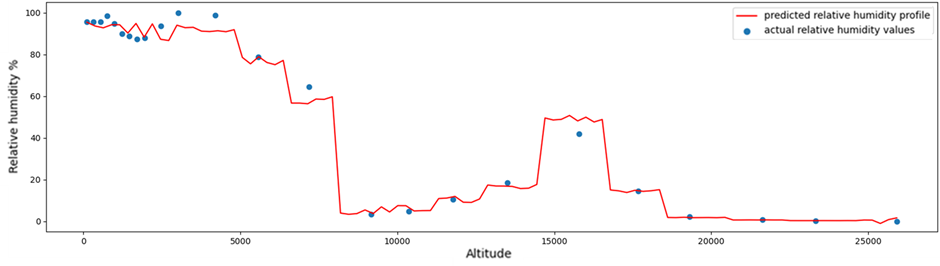

# Spatial-Temporal Prediction
****
## conference paper link
 https://link.springer.com/book/10.1007/978-981-19-3938-9
 paper title: 3D spatial Temporal prediction of Atmospheric Quantities for Cn2 modelling.
***
### Project Discription
This project aims to build a model which takes in scalar inputs of latitude, longitude, time at which the prediction is to be made and the atmospheric parameter to be predicted to get a predicted altitude profile of that atmospheric parameter.
****
#### Data set over view
The dataset used in this project was taken from the NCMRWF website (https://rds.ncmrwf.gov.in/datasets) which is publically accessible.
In this dataset, after preprocessing, time is considered in seconds from the start of the year and the coordinates in degrees. The datset has 24 different pressure levels, 4 latitude variations, 4 longitued variations and 2726 timesteps.

****
The plot below is how the output of the combined model looks like.

****
The details of how to use the codes is present in the readme in each subfolders of the src files.
